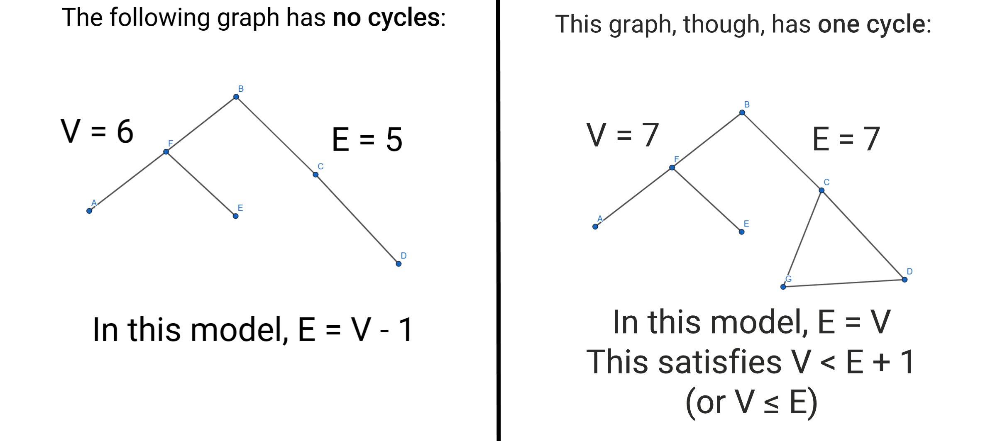

# 2.2 Notes: Trees

### Preview
- A **tree** is a connected graph containing no cycles.
- A **forest** is a graph containing no cycles. This means that a tree is a connected forest
- Some things that are commonly called *trees*, like family trees or decision trees, likely have a cycle somewhere far back (like a common ancestor, in a family tree)
- A **spanning tree** is one that includes all of the vertices of a connected graph.

### Properties of Trees
- A graph $T$ is a tree if and only if between every pair of distinct vertices of $T$ there is a unique path.
  - First, we will prove that if $T$ is a tree, then between every pair of distinct vertices there is a unique path.
    - Assume $T$ is a tree
    - Let $u$ and $v$ be distinct vertices (if $T$ only has one, then it is true by default)
    - Since $T$ is a tree, it is, by definition, connected. This means that every pair of distinct vertices has a path
    - To prove that there is a *unique* path between each pair, we can assume the contrary; that there are *two* paths between $u$ and $v$
    - Since these two paths are different, they must diverge at some point. We will call the first vertex where they diverge $u'$
    - Since both paths end at $v$, there must be a first vertex in common after $u'$, which we will call $v'$
    - Now consider the two paths from $u'$ to $v'$. These form a cycle, which contradicts the assumption that $T$ is a tree.
    - This means that the statement is true.
  - Now, we must prove the converse: If between every pair of distinct vertices of $T$ there is a unique path, then $T$ is a tree.
    - Assume that between every pair of distinct vertices of $T$ there is a unique path.
    - Since there is a path between every pair of vertices, we know that $T$ is connected.
    - Now, we need to show that $T$ has no cycles
    - Let's assume that it has cycles, to prove by contradiction
    - Let $u$ and $v$ be distinct vertices in a cycle of $T$. Since we can get from $u$ to $v$ by going clockwise or counterclockwise, that means there are two paths from $u$ and $v$, which contradicts our original assumption that there is a unique path between every vertex.
  - Both sides have been proven, so the if and only if statement is true.

- Deriving from this proposition we get the corollary that a graph $F$ is a forest if and only if between any pair of vertices in $F$ there is at most one path. 

- Any tree with at least two vertices has at least two vertices of degree one.
- If $T$ is a tree with $v$ vertices and $e$ edges, then $e = v - 1$.

### Spanning Trees
- Given a connected graph $G$, a **spanning tree** of $G$ is a subgraph of $G$ which is a tree and includes all the vertices of $G$.
- Every connected graph has at least one spanning tree.
  - Given a connected graph $G$, if there are no cycles, then $G$ is already a tree and that's the whole story.
  - Otherwise, let $e$ be an edge in that cycle and consider a new graph $G_1 = G - e$ (delete the edge). Since $e$ was part of a cycle, there were at least two paths connecting the vertices touching it. We repeat until the new graph we create has no cycles. The final result will be a *spanning tree*, since we never removed any vertex.
- A **minimum spanning tree** is a spanning tree with the smallest possible combined *weight* to it (where some edges weigh, or "cost" more than others).

### Rooted Trees
- If one vertex of a tree is designated as the **root** of the tree, then every other vertex can be characterized by its position relative to the root.
- Since there is one unique path between every two vertices in a tree, there is one path from every vertex back to the root.
- With two adjacent vertices, the one closer to the root is considered the **parent** of the other, while the one further away is labeled as the **child** of the parent.
  - There are also **grandchildren** and **grandparents**, so we often say:
    - A vertex $v$ is a **descendent** of vertex $u$ provided $u$ is a vertex on the path from $v$ to the root.
- We can choose where the root is in a tree.
- Every tree must also be a bipartite graph:
  - A bipartite graph is one where the vertices can be divided into two sets, $A$ and $B$, such that no two vertices in the same set are adjacant. In short, a bipartite graph is one with no odd-lengthed cycles. Since a tree has no cycles at all, it must be bipartite

### Practice Problems
1. Are the following statements true or false?
   1. There is a connected graph with exactly one spanning tree. (TRUE)
   2. If a graph has two more vertices than edges, then it is not connected. (TRUE)
   3. Every bipartite graph is a tree. (FALSE)
   4. Every connected forest is a tree. (TRUE)
   5. If a graph has exactly one more vertex than it has edges, then the graph is a tree. (FALSE)
2. A forest contains 50 vertices and 44 edges. How many connected components does the graph have?
   1. A forest contains 50 vertices and 44 edges. How many connected components does the graph have?
      1. 6
3. A connected graph with 12 vertices contains 17 edges. Without knowing which particular graph this is, what is the smallest and largest possible number of edges you can remove to get a spanning tree?
   1. Smallest number of edges to remove: 6
   2. Largest number of edges to remove: 6
      1. Both of these responses are due to the fact that, in tree $T$, where $E$ is the number of edges and $V$ is the number of vertices, $E = V - 1$
4. The average degree of a tree is 1.96 (that is, if you sum the degrees of vertices and divide by the number of vertices, you get 1.96). How many vertices does the tree have?
   1. 50
   2. This is because the sum of degrees is equal to 2 times the number of edges:
      1. $1.96 = \frac{\sum degrees}{V}$
      2. $1.96 = \frac{2E}{V}$
      3. Additionally, $E = V - 1$
      4. $1.96 = \frac{2V - 2}{V}$
      5. After some rearranging, $0.4V = 2$
      6. This means that $V = 50$
5. A tree contains some number of leaves (degree 1 vertices) and four non-leaf vertices. The degrees of the non-leaf vertices are 10, 7, 4, and 2. How many leaves does the tree have?
   1. Smallest number of leaves possible: 17
   2. Largest number of leaves possible: 17

### Additional Exercises
6. If a graph $G$ with $v$ vertices and $e$ edges is connected and has $v < e + 1$, must it contain a cycle?
   - We assume that the statement is false to prove by contradiction: $G$ is a graph with $v$ vertices and $e$ edges that is connected and has $v < e + 1$, but it does NOT contain a cycle.
   - If $G$ does not have cycles, then it is a tree by definition of a tree. 
   - In a tree, $e = v - 1$
   - This means that $v = e + 1$
   - This contradicts the assumption that $v < e + 1$
   - 