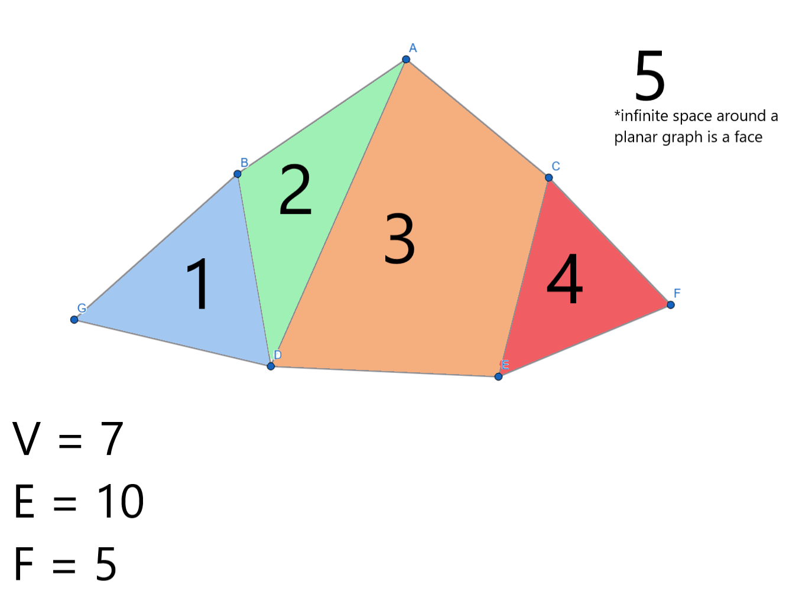
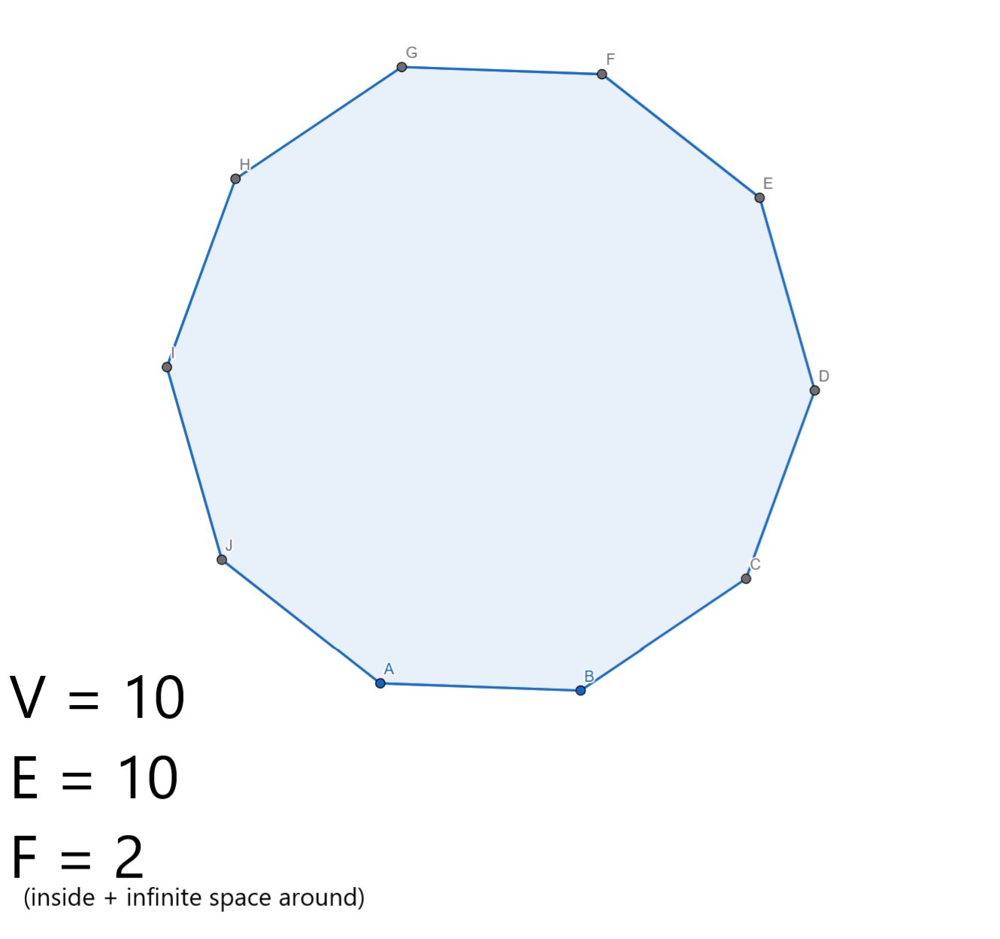

# 2.3 Notes

### Section Preview

- A **planar** graph is a connected graph that can be drawn without any edges crossing
- The plane is divided into regions called **faces**
  - The infinite space around the graph is considered one of the faces
- For it to not be planar, it must not be possible to move any vertices to make it planar

### Euler's Formula for Planar Graphs

- Euler's formula, for any planar graph with $v$ vertices, $e$ edges, and $f$ faces, goes as follows:
  - $v - e + f = 2$

- We can use this formula for any planar graph, and it can be proven by manually building a planar graph

### Non-Planar Graphs

- If a connected graph has too many edges and too few vertices, then some edges will have to intersect.
- $K_5$
  - Prove by contradiction:
  - $v = 5$, $e = 10$
  - $5 - 10 + f = 2$
  - $f = 7$ would have to be true for it to be a planar graph, according to Euler's formula
  - The boundary relationship $3f \leq 2e$ ($21 \leq 20$ is false)
  - This means $K_5$ is not planar.
  - For any planar graph, $gf \leq 2e$, where $g$ is girth, the smallest cycle in a graph

### Polyhedra
- A **polyhedron** is a geometric solid made up of flat polygonal faces joined at edges and vertices
- A **convex** polyhedron is one where any line segment connecting two points on the interior must be entirely contained inside the polyhedron.
- Every convex polyhedron can be projected onto the plane without edges crossing.
- A **regular polyhedron** is one where each face is an identical regular polygon and each vertex joins an equal number of faces
  - There are only five of these:
    1. Cube
    2. Tetrahedron
    3. Octahedron
    4. Dodecahedron
    5. Icosahedron

### Additional Exercises
3. Is it possible for a connected graph with 7 vertices and 10 edges to be drawn so that no edges cross and create 4 faces?
   - In a planar graph, $v - e + f = 2$ (Euler's formula)
   - This means that $7 - 10 + 4 = 2$, which is not true ($7 - 10 + 4$ is actually equal to $1$)
   - Since the graph therefore cannot be planar, this means that a graph with 7 vertices, 10 edges, and 4 faces CANNOT be drawn such that no edges cross.
   - Based on Euler's formula, in order for a planar graph to have 7 vertices and 10 edges, it must have *5* faces, not 4:
     - 
     - In the above graph, you could not rearrange the vertices to make the graph only have 4 faces (in other words, it **must** have 5 faces to be planar)
4. Is it possible for a graph with 10 vertices and edges to be a connected planar graph?
    - Euler's formula for a planar graph is that $v - e + f = 2$
    - In this scenario, that means that $10 - 10 + f = 2$ and so that therefore, there must be 2 faces.
    - So yes, there is one possible connected planar graph with 10 vertices, 10 edges, and 2 faces
    - Here is what it looks like:
      - 