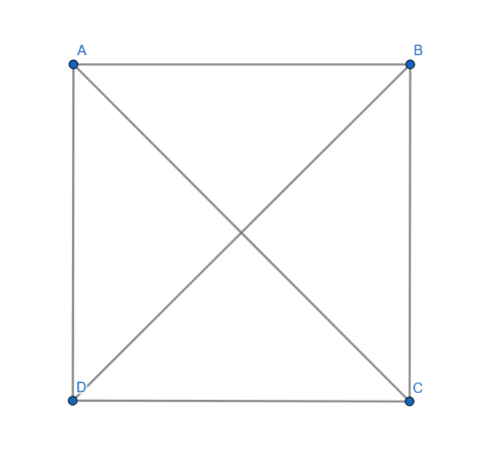
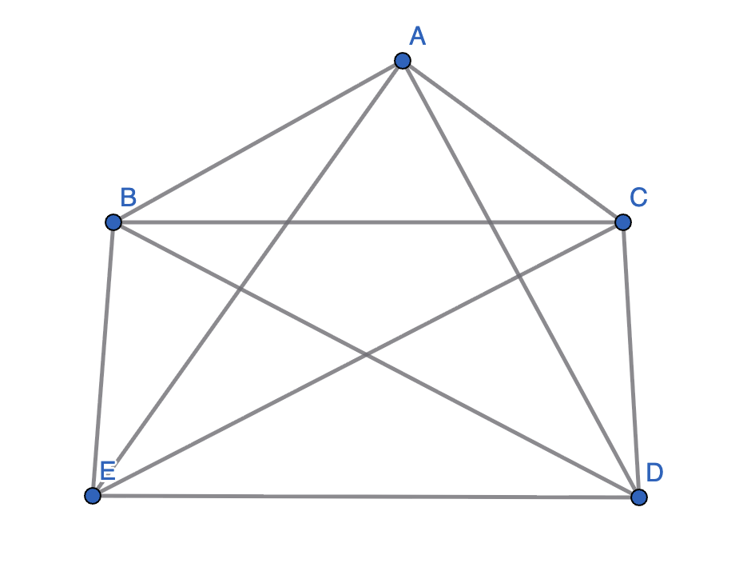
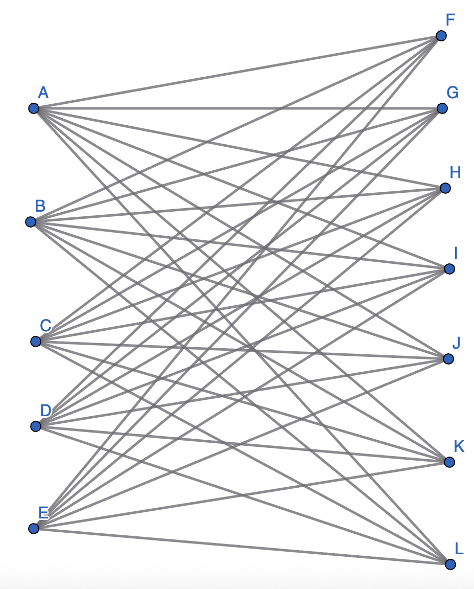
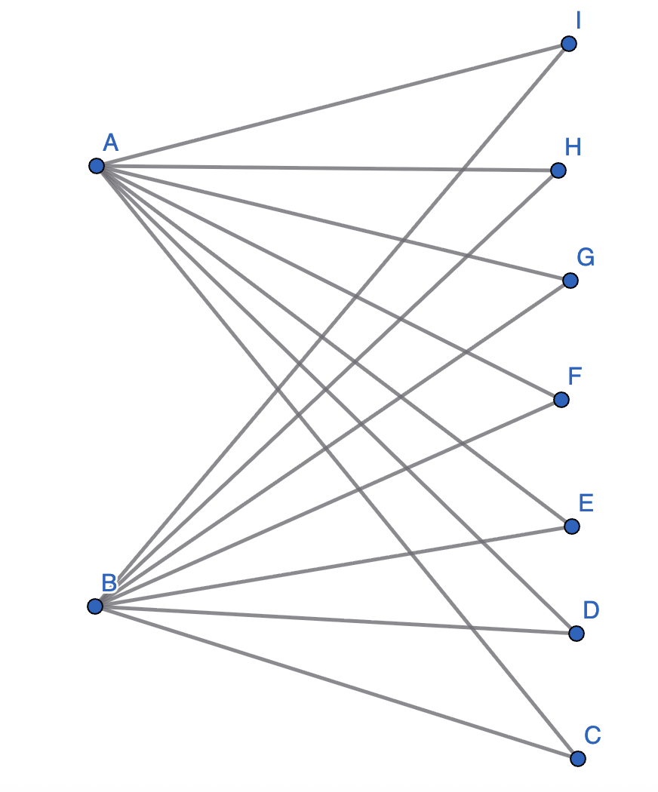
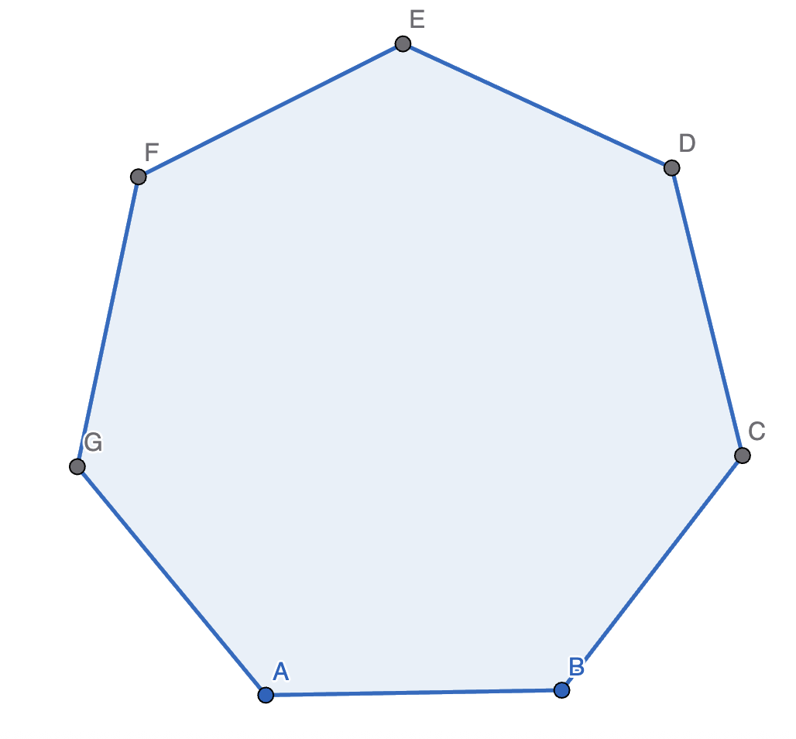
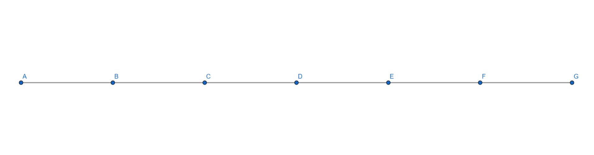

# 2.4 Notes: Euler Trails and Circuits

### Preview
- A **walk** in a graph is a sequence of vertices where every vertex is adjacent to the vertices before and after it; a path
  - If a walk travels every edge one time, then it is an **Euler trail**.
  - If an Euler trail walk starts and ends at the same vertex, then it is an **Euler circuit**
- On some graphs, we can simply trace every path and find if a graph has an Euler trail/circuit

### Conditions for Euler Trails
- A graph *never* has an Euler circuit if it has a vertex of degree 1
- In addition, we can conclude that an Euler circuit cannot have any *odd* degree vertices, meaning the degree of every vertex is even
- An Euler trail can have only *two* odd degree vertices at maximum: the starting point and the ending point of the walk

### Hamilton Paths
- A **Hamilton path** is a path that goes through every vertex exactly one time.
- A **Hamilton cycle** is a Hamilton path that starts and ends at the same vertex
- For smaller graphs, we can simply try every path to find if it has a Hamilton path.
- For larger graphs, though, there is no simple test to see whether or not a grpah has a Hamilton path
  - Computers can't even do this

### Additional Exercises
2. Which of the following graphs have Euler circuits?
   - $K_4$
     - Here is a visual of a $K_4$ graph
       - 
     - The graph above *does* have an Euler circuit. We know this because the degree of every vertex is even.
   - $K_5$
     - Here is a visual of a $K_5$ graph
       - 
     - The graph above has an Euler circuit, which we can see because there are no odd-degree vertices.
   - $K_{5,7}$
     - Here is a visual of a $K_{5,7}$ graph
       - 
     - This graph does *not* have an Euler circuit. The degree of all vertices in a graph must be even for that graph to contain an Euler circuit, and in this graph, there is not a single even-degree vertex.
       - This means that it does not have an Euler trail, either, as it has more than 2 odd-degree vertices
   - $K_{2,7}$
     - Here is a visual of a $K_{2,7}$ graph
       - 
     - This graph does not have an Euler circuit, as vertices A and B (on the image above) have degrees of 7. Since a graph with an Euler circuit must have only vertices of even degree, it cannot have one.
       - This graph does, though, have an Euler trail, as A and B are the only odd-degree vertices. 
   - $C_7$
     - Here is a visual of a $C_7$ graph
       - 
     - This graph *does* have an Euler circuit. We can see this easily by looking at the graph and seeing that all vertices have a degree of 2. In addition, we know from previous sections that in *all* cycle graphs, the degree of every vertex is 2.
   - $P_7$
     - Here is a visual of a $P_7$ graph
       - 
     - This graph does *not* have an Euler circuit. For a graph to contain an Euler circuit, it must not have any odd-degree vertices. This graph, however, has 2 odd-degree vertices: the two on the ends (vertices A and G on the image above).
       - This graph does, however, have an Euler trail, as it has exactly *two* odd-degree vertices.