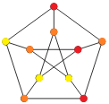

# 2.5 Coloring

### Section Preview

- Generally, when color coding maps, map  makers use around 7 to make it so that every neighboring region is colored differently
- If we placed a vertex in the center of each region and connect all vertices that share a border, we can create a graph of the map
- We can color vertices on this new map to correspond to coloring regions
- If a coloring of vertices in a graph (a **vertex coloring**) has all adjacent vertices colored differently, then it is a **proper** coloring.
- The smallest number of colors needed to get a proper vertex coloring is called a graph's **chromatic number**.
  - denoted as $\chi(G)$

### Coloring Vertices
- Any graph $K_n$ has chromatic number of $n$.

### Additional Exercises
3. Find the chromatic number of each of the following graphs.
   - 
     - $\chi = 2$: The middle vertices (top, center, bottom) are all connected to only 2 other vertices, which are the same vertices on the graph, and since those vertices are not directly connected to each other, they can be the same color, so $1$ color for the left and right $+$ $1$ color for the top, middle, and bottom $= 2$.
   - 
     - $\chi = 3$: For even cycle graphs, the chromatic number will always be 2. On the other hand, though, odd cycle graphs, such as this one (which is $C_7$), will have a chromatic number of 3.
   - 
     - $\chi = 4$: The outer part of the graph is an odd cycle, so it needs a chromatic number of $3$. The vertex in the center is connected to all of the other vertices in the graph, so it must be its own color.
   - 
     - This graph is a connected graph $K_5$. As stated in the chapter, any graph $K_n$ has chromatic number of $n$, since every vertex is adjacent to every other vertex. Thus, the chromatic number is 5.
   - 
     - $\chi = 3$: The outer pentagon is an odd cycle, so the chromatic number is at least $3$. Using these 3 colors, we can create the graph above, which has proper coloring, so the chromatic number is 3.