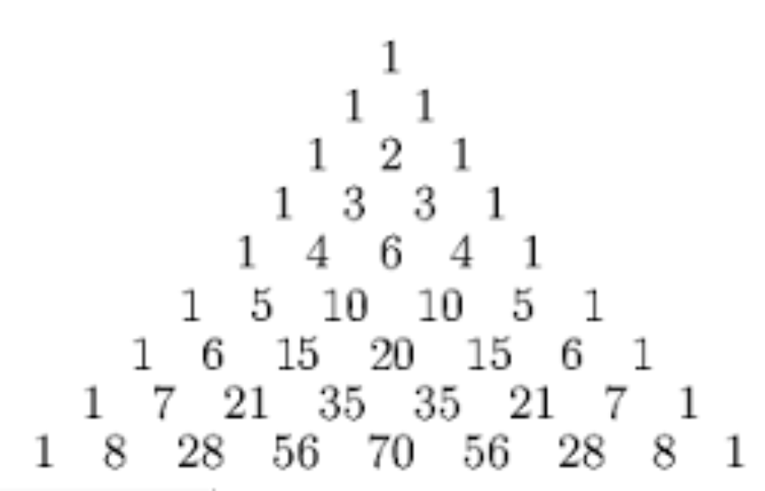

# 3.1 Notes: Pascal's Triangle

### Additional Exercises
3. Explain why the coefficient of $x^5y^3$ is the same as the coefficient $x^3y^5$ in the expansion of $(x + y)^8$?
   - 
   - Looking on the 8th row of Pascal's triangle, the 1 all the way to the left is the coefficient of $x^8y^0$ (or just $x^8$), the one next to that ($8$) is the coefficient of $x^7y^1$, and so on
   - This means that the 4th number in the row ($56$) is the coefficient of $x^5y^3$, so the coefficient of that is $56$.
   - Now we can go 2 spaces to the right of that (the 6th number) to see the coefficient of $x^3y^5$ is also $56$.
   - The reason that the two monomials have the same coefficient, mathematically:
     - The coefficient of $x^ky^{n-k}$ is $\binom{n}{k}\text{.}$
     - Using the combination formula:
       - $\binom{n}{k}= \frac{n!}{r!(n-r)!}$
     - $\frac{8!}{3!(8-3)!} = 56$
       - Above shows that $x^3y^{(8-3)}$, or $x^3y^5$, has a coefficient of $56$
     - $\frac{8!}{5!(8-5)!} = 56$
       - This shows that $x^5y^{(8-5)}$, or $x^5y^3$, has a coefficient of $56$, too.